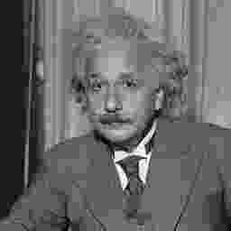

# Problems using the SSIM image quality metric

Chris Lomont, 2023, www.lomont.org, blog [post](https://github.com/ChrisLomont/SSIM).

**TL;DR;** [Get the code!](https://github.com/ChrisLomont/SSIM)

## Introduction

The **structural similarity index measure** (**SSIM**)  [1] is a popular method to predict perceived image quality. Published in April 2004, with over [46,000 Google Scholar citations](https://scholar.google.com/scholar?q=Image+quality+assessment:+from+error+visibility+to+structural+similarity&hl=en&as_sdt=0&as_vis=1&oi=scholart), it has been re-implemented hundreds, perhaps thousands, of times, and is widely used as a measurement of image quality for image processing algorithms (even in places where it does not make sense, leading to even worse outcomes!).

Unfortunately, if you try to reproduce results in papers, or simply grab a few SSIM implementations and compare results, you will soon find that it is (nearly?) impossible to find two implementations that agree, and even harder to find one that agrees with the original from the author. I ran into this issue many times, so I finally decided to write it up once and for all (and provide clear code that matches the original results, hoping to help reverse the mess that is current SSIM).

Most of the problems come from the original implementation being in MATLAB, which not everyone can use. Running the same code in open source Octave, which claims to be MATLAB compatible, even returns wrong results! 

This large and inconsistent variation among SSIM implementations makes it hard to trust or compare published numbers between papers. The original paper doesn't define how to handle color images, doesn't specify what color space the grayscale values represent (linear? gamma compressed?), adding to the inconsistencies and results. The lack of color causes the following images to be rated as visually perfect by SSIM as published. The paper [2] demonstrates so many issues when using SSIM with color images that they state "**we advise not to use SSIM with color images**". 

|  |  |  |
| :------------------------------------: | :--------------------------------------: | :--------------------------------------: |
|              **Original**              |       **SSIM 1.000 with original**       |       **SSIM 1.000 with original**       |

All of this is a shame since the underlying concept works well for the given compute complexity. A good first step to cleaning up this mess is trying to get widely used implementations to match the author results for their published test values, and this requires clearly specifying the algorithm at the computational level, which the authors did not. I explain some of these choices, and most importantly, I provide [original, MIT licensed, single file C++ header and single file C# implementations](https://github.com/ChrisLomont/SSIM); each reproduces the original author code better than any other version I have found. 

## Testing

For example, [the SSIM author's website](https://www.cns.nyu.edu/~lcv/ssim/) has the following example images with SSIM scores (each compared to the upper left Einstein image):

|  <br />Original: MSE=0, SSIM = 1 | <br />Meanshift: MSE=144, SSIM=0.988 | <br />Contrast: MSE=144, SSIM=0.913 |
| ------------------------------------------------------------ | ------------------------------------------------------------ | ------------------------------------------------------------ |
| <br />**Impulse: MSE=144, SSIM = 0.840** | <br />**Blur: MSE=144, SSIM=0.694**  | <br />**Jpg: MSE=142, SSIM=0.662**     |

However, if you take multiple existing implementations of SSIM, you end up with something like the next table (notes [1] - [9] following). The left column is the **truth** values from the author site above using [their MATLAB implementation](https://www.cns.nyu.edu/~lcv/ssim/ssim.m) of the algorithm. Values close ($\pm 0.001$) to the **truth** are in **bold**. The bottom two rows on the [LIVE image dataset](https://live.ece.utexas.edu/research/Quality/subjective.htm) are described below.

| Image             | SSIM [1]  | PIL [2]   | Scikit [3] | Pytorch IQA [4] | OpenCV [5] | Mehdi [6] | Kornel [7] | Octave[8] | Lomont C#/C++ [9] |
| ----------------- | --------- | --------- | ---------- | --------------- | ---------- | --------- | ---------- | --------- | ----------------- |
| Einstein          | **1.000** | **1.000** | **1.000**  | **1.000**       | **1.000**  | **1.000** | **1.000**  | **1.000** | **1.000**         |
| meanshift         | **0.988** | **0.987** | **0.988**  | **0.988**       | **0.987**  | **0.987** | 0.997      | **0.988** | **0.988**         |
| contrast          | **0.913** | 0.902     | **0.913**  | **0.913**       | 0.901      | 0.901     | 0.975      | **0.913** | **0.913**         |
| impulse           | **0.840** | 0.833     | **0.840**  | **0.840**       | **0.840**  | **0.840** | 0.803      | 0.822     | **0.840**         |
| blur              | **0.694** | 0.713     | **0.694**  | **0.694**       | 0.702      | 0.702     | 0.892      | 0.725     | **0.694**         |
| jpg               | **0.662** | 0.673     | **0.662**  | **0.662**       | 0.670      | 0.670     | 0.832      | 0.686     | **0.662**         |
| Max error on LIVE | **0.000** | 0.301     | 0.336      | 0.336           | 0.328      |           |            |           | **0.001**         |
| Avg error on LIVE | **0.000** | 0.075     | 0.081      | 0.081           | 0.081      |           |            |           | **0.000**         |

[1] SSIM author provided MATLAB script at https://www.cns.nyu.edu/~lcv/ssim/ treated as the correct SSIM values.
[2] A popular Python library https://pypi.org/project/SSIM-PIL/ based on the imaging library Pillow.
[3] The Python `scikit-image` implementation ([example](https://scikit-image.org/docs/stable/auto_examples/transform/plot_ssim.html) , [docs](https://scikit-image.org/docs/stable/api/skimage.metrics.html), see [StackOverflow post](https://stackoverflow.com/questions/58604326/which-ssim-is-correct-skimage-metrics-structural-similarity)). Getting this to match took a lot of parameter fiddling.
[4] A commonly used pytorch implementation https://pypi.org/project/IQA-pytorch/.
[5] A version on the OpenCV website https://docs.opencv.org/3.4/d5/dc4/tutorial_video_input_psnr_ssim.html.
[6] An [independent version](http://mehdi.rabah.free.fr/SSIM/) linked from the SSIM site.
[7] Another [independent version](https://kornel.ski/dssim) linked from the original site.
[8] The original MATLAB code running on [GNU Octave](https://octave.org/), which is "Drop-in compatible with many MATLAB scripts". 
[9] My [single file C++ and C# versions](https://github.com/ChrisLomont/SSIM), which match.

I want to call attention to the facts that even the independent reference implementations [6,7] linked from the original SSIM site differ significantly from each other and from the original version!  The authors MATLAB code run as-is on the open source GNU Octave returns different values. So perhaps the split in quality happened quickly and spread early....

### The LIVE image dataset

Besides the six Einstein images above, the [SSIM authors](https://www.cns.nyu.edu/~lcv/ssim/) provide other dataset results, including results of SSIM on their own dataset, the [LIVE image dataset](https://live.ece.utexas.edu/research/quality/subjective.htm) (Release 2). This dataset is 982 images derived from 29 source images (24 bit RGB, resolutions around 768x512), with multiple distortion types (JPEG2000, JPEG, White noise, Gaussian Blur, bit errors in image decoding), at multiple distortion rates, which are then subjectively ranked to illustrate the benefits of SSIM over PSNR or MSE. You can obtain the dataset by following their request process.

The SSIM authors provide the results across three MATLAB binary blobs, which I decoded into text files using Python:

```python
import scipy.io
#print(scipy.io.loadmat('dmos.mat'))
print(scipy.io.loadmat('refnames_all.mat'))
#print(scipy.io.loadmat('LIVE_SSIM_results.mat'))
```

The resulting text files were cleaned and merged to get a [text file with 982 lines](allcompares.txt), each with two files to compare and the truth SSIM score. This was ran through all the SSIM implementations above (Python script for many [here](test_SSIM.py), some others had downloadable executables). All of them failed since none of them implement the downsampling correctly from the authors website. The downsampling is used to handle changes in pixel size compared to resolution of the human visual system: a change in a tiny pixel should have less effect than a change in a large pixel, but all the above ignore this. All of them have a max error of ~0.300 SSIM, which is huge, and have an average error of ~0.070, which is still quite significant.

## Causes of errors

The large variation is the result of 

1. The original implementation is in MATLAB, with much of the work done by internal MATLAB algorithms that are not clearly specified, making re-implementation difficult.
2. The original paper is only for grayscale, and that is not even well specified (linear? gamma compressed?). Author test images are generally done in sRGB (get pixels from file, use rgb2Gray for color, pass grayscale into SSIM). The lack of color awareness is demonstrated with the Lenna images in the Introduction above. In practice, some implementations use linear spaces, others do not, most ignore it simply reading files, leading to more variety.
3. People reading the paper had to make choices for unspecified behavior. Such behavior includes
   1. Normalizing the Gaussian filter (or not)
   2. How to align even sized subsampling filters. 
   3. How to handle image reflection at boundaries
   4. How to convert color to grayscale. The original uses MATLABs `rgb2gray` which uses a [slightly nonstandard method](https://www.mathworks.com/help/matlab/ref/rgb2gray.html) that replaces the Rec.601 red coefficient of 0.299 with the value 0.2989. Looking into code history shows the MATLAB version was created before sRGB was standardized.
4. The lack of defined color versions has led to many different ways of handling color images, many not specified in documentation, yet all are called SSIM. More details are below.

Some issues with SSIM as specified:

1. It's not really a metric (allows < 0 values, SSIM can be 1.000 for dissimilar images, does not satisfy the triangle inequality)
2. It's not rotationally symmetric: image rotation by 90 degrees can result in different values, even though the 'quality' has not changed. This is a result of the downsampling filter choices (it could be fixed, but would break the values matching the original)
3. It allows values < 0, leading some code to clamp at 0, but not all do. The original did not.
4. It's not clear if computing grayscale values from byte valued RGB should be used as real numbers, or to quantize them back into 0-255 (and [how to do that quantization](https://lomont.org/posts/2023/accuratecolorconversions/)). I prefer not to re-quantize since it adds more places to add variants in choices.

There is ample literature covering some of these issues. A good intro is ["Understanding SSIM"](https://arxiv.org/pdf/2006.13846.pdf) (arxiv 2006.13846) [2].

## Color issues

As mentioned above, SSIM doesn't deal with color errors well, since it's only defined on grayscale issues. 

Images found on internet are gamma encoded 2.2 sRGB, not quite https://stackoverflow.com/questions/58203124/how-do-i-tell-if-an-image-is-gamma-encoded-when-imported-to-numpy

TODO - rethink, check items here?

are images gamma stored?

Many methods have been used to make SSIM variants that are color aware. However, there is in general a huge mess in algorithms on the web that conflate Y'CbCr and YCbCr (note the ' on Y'), further confusing what the SSIM variations and values represent. Y' is luma, Y is luminance. Luminance is computed from linear RGB; luma is computed from gamma encoded R'G'B'. Most of this confusion comes from not being able to use ' in symbol names in code, then people copy that code, then people conflate the two over time.

Note the authors in many papers use the term luminance, but their code and results are based on luma!

Since the original SSIM works (not explicitely, but in practice) in the gamma compressed sRGB space (actually R'G'B' !), the following TODO

Assume R'G'B' colors, each in [0,1] 

1. Perform SSIM on three channels independently and weight them
2. R'G'B' weights are [generally 1/3 each](https://dsp.stackexchange.com/questions/75187/how-to-apply-the-ssim-measure-on-rgb-images)
3. Some implementations treat the image as a WxHx3 tensor, and accidentally filter across all three channels, which is not the same as independently computing per channel and averaging. [MATLAB uses the 3 tensor (less correct in my opinion), Julialang uses the per channel, and they get different results](https://dsp.stackexchange.com/questions/75187/how-to-apply-the-ssim-measure-on-rgb-images)
4. Convert to Y'CbCr , do each component, and weight them. This is fraught with errors. Some examples
5. There are many papers (e.g., [here](https://hpcf.umbc.edu/research-projects-hpcf/color-differencing-structural-similarity-index-metric-cd-ssim/), [here](https://ieeexplore.ieee.org/document/8079929), [here](https://ieeexplore.ieee.org/document/7351345), [here](https://www.spiedigitallibrary.org/journals/journal-of-electronic-imaging/volume-25/issue-06/063015/Improved-structural-similarity-metric-for-the-visible-quality-measurement-of/10.1117/1.JEI.25.6.063015.full?SSO=1)) promoting many methods, but none seem to be dominant in practice

1. 1. The weights chosen vary
      1.  [Here](https://github.com/thorfdbg/ssim/blob/master/ReadMe) are weights of 0.95, 0.02, 0.03
      2. The authors have a later paper [3] using the weights 0.8, 0.1, 0.1 (note this paper says luminance, but as usual the code and their results are not in linear space!)
      3. Other papers have criticized these choices as failing often, see reference [2]
   2. The channel ranges are not the same, so averaging may make a mess?!
   3. 
2. Convert to YCbCr - this is generally a mistake!
3. Use other (rarer) color spaces, e.g., 

Many places make even rarer choices. For example, https://pngquant.org/dssim.html uses L * a * b * space (quite rate for SSIM) then even does chroma subsampling, which I've only seen on this version, so will certainly not match many places. Yet this code gets used and people use these 'SSIM' values to compare to other algorithms....

https://stackoverflow.com/questions/41944970/the-interpretation-of-scikit-image-ssim-structural-similarity-image-metric-neg negative values

# Code

To make the current version of the code, I took my current update of my existing code (which was not as correct as this one, and unfortunately has been added to many other projects over time since it was an early freely available version....), and one by one chased all bugs out, tracking down how the MATLAB script and code worked, and did testing across possible choices until I obtained a match.

I didn't find any serious errors in the original - I was afraid I would, which would wreck this project since I didn't want to re-implement some obviously wrong algorithms. One place that did bother me, but is only a small difference, is the non-standard `rgb2gray` conversion traced back to the MATLAB routine.

Some choices needed:

1. The Gaussian is normalized
2. 

Note C#/C++ numeric things for ports

gaussian normalized - write more items here

to use: sRGB, gamma 2.2 TODO?, use the given grayscale, not sure about color yet...

important  - did not have to add bugs! (well, except the weird rgb2gray)

With such large and inconsistent variation you cannot rely on published SSIM values without lots of legwork to figure out what they did, perhaps having to redo their work.

How did I make mine? TODO - rev engineered, careful math, noting each psosible interprestation of the paper, and tresting the combinations to find this one. Final bug somewhere allowing max error of 0.001, which should not exist. matlab proprietary hard for people to use

1. add links to https://github.com/ChrisLomont/SSIM
2. https://lomont.org/posts/2023/ssim/

# References

[1]  [Z. Wang](http://www.ece.uwaterloo.ca/~z70wang/), [A. C. Bovik](http://live.ece.utexas.edu/people/bovik/), [H. R. Sheikh](http://live.ece.utexas.edu/People/people_detail.php?id=92) and [E. P. Simoncelli](http://www.cns.nyu.edu/~eero/), "[Image quality assessment: From error visibility to structural similarity](https://ece.uwaterloo.ca/~z70wang/publications/ssim.html)," *IEEE Transactions on Image Processing,* vol. 13, no. 4, pp. 600-612, Apr. 2004, see https://www.cns.nyu.edu/~lcv/ssim/

[2] Jim Nilsson, Tomas Akenine-Möller, ["Understanding SSIM"](https://arxiv.org/abs/2006.13846), 2020, (arxiv 2006.13846)

[3] Zhou Wang, Ligang Lu, Alan C. Bovik, "[Video quality assessment based on structural distortion measurement](https://www.sciencedirect.com/science/article/abs/pii/S0923596503000766)", 2004.


# TODO - 

1. code prepared (C++, C#)

   1. c++ history in header
   2. match comments in C++/C# code

2. c++ performance - use pointers and referecnes?

3. edit files to self link

4. pub to blog and github

5. update code on old website - add link or forwarding?

   
